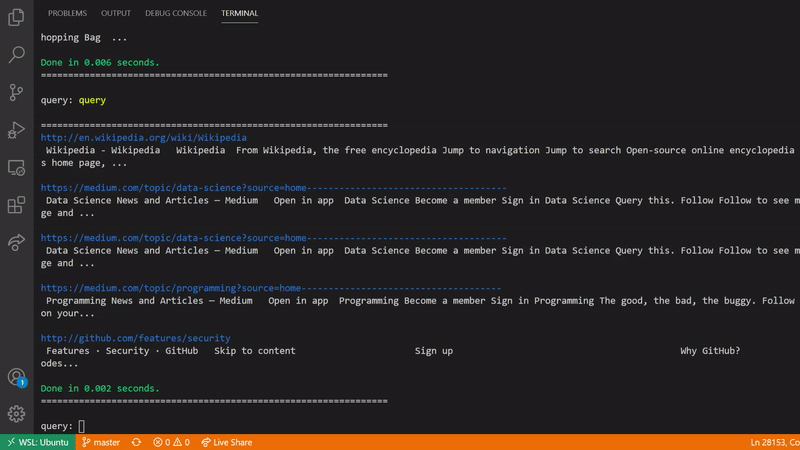

# Web Crawler



This is a simplified search engine built with [Chilkat's CkSpider](https://www.chilkatsoft.com/), [Gumbo Parser](https://github.com/google/gumbo-parser) and [RapidJSON](https://github.com/Tencent/rapidjson/). The software will collect a given number of web pages anb build an index for information retrieval over that collection. The default number of pages the crawler will try to visit before halting is 100000 (one hundred thousand). You can change this value by modifying the ```PAGES_TO_COLLECT``` constant located in ```main.cpp```.

* [Installing](#installing)
* [Usage](#usage)
* [Example](#example)

## Installing

[Installing Chilkat for cpp](https://www.chilkatsoft.com/downloads_CPP.asp)

After installing Chilkat: 

```
$ sudo make install
$ make
```

This will install [Gumbo Parser](https://github.com/google/gumbo-parser) and build the project (you may need to run ```sudo ldconfig``` afterwards), creating an executable file within ```build/```.

## Usage

To run the application, you can either use ```make run``` (to run with sample inputs, this will automaticaly crawl with a predefined seed at ```input/seed``` and build the index for those pages) or use ```./build/web-crawler``` with custom options.

The available options are:

* ```-c [SEED_FILE]``` replacing ```[SEED_FILE]``` with the path to the file containing your seeds, see [examples](#example). This will start the crawling process with ```[SEED_FILE]``` as seed.
* ```-i [COLLECTION_PATH - optional]``` replacing ```[COLLECTION_PATH]``` with the path where your html collection is stored or simply leaving it blank, by default the collection path will be ```output/collection.jl```. This will build an index for the documents present at ```[COLLECTION_PATH]``` and an index for the vocabulary of the collection. Two output files briefing.doc.idx and index.idx, the index for the documents and the vocabulary respectivelly, will be created at ```output/```.
* ```-l [VOCABULARY_INDEX_PATH]``` which will load the vocabulary index file at ```[VOCABULARY_INDEX_PATH]``` to memory (carefull there).
* ```-q [VOCABULARY_INDEX_PATH] [COLLECTION_INDEX_PATH]``` where both ```[VOCABULARY_INDEX_PATH]``` and ```[COLLECTION_INDEX_PATH]``` are optional, however, if ```[COLLECTION_INDEX_PATH]``` is provided, so should be ```[VOCABULARY_INDEX_PATH]```. This will open the CLI for performing queries. Defaults are ```./output/index.idx``` and ```./output/briefing.doc.idx```.

The documents on the collection are indexed in batches, by default, the maximum batch size is 4096, defined in ```include/indexer.hpp```. If the batch size is too big, the application will consume a large amount of RAM, however, if it is overly small, the execution time and disk usage may increase. On [this document](https://github.com/LuizPPA/web-crawler/blob/master/docs/Information_Retrieval_Assignment_4.pdf) is presented a chart roughly illustrating how memory consumption escalates with batch size.

> *Be cautious when modifying the maximum batch size as it will require a lot of RAM, e.g. indexing 60000 documents at once can consume over 5GB. Also, make sure you have enough storage space.*

The output will be a ```collection.jl``` file, which is going to be the collected documents as list of JSON objects separated by line breaks, and a ```index.idx``` file, which will be the inverted index for that collection. The JSON for the documents is an object with two keys: _url_ and _html\_content_, containing the link of the document on the web and HTML content of the document respectively. Each line of the inverted index representes a term following this format:

_term n d<sub>1</sub> n<sub>d1</sub> p<sub>1,d1</sub> p<sub>2,d1</sub> p<sub>ndn,dn</sub>_

Where term is the indexed word, n is the number of documents where the term is present,  d<sub>i</sub> is the i-th document where the term is present, n<sub>di</sub> is the number of times the term appears in d<sub>i</sub> and p<sub>j,di</sub> is the position of the j-th occurrence of the term in d<sub>i</sub>.

## Example

Your seed file should be a list of urls where the crawler will start visiting separated with line breaks like:

```
ufmg.br
kurzgesagt.org
www.cam.ac.uk
www.nasa.gov
github.com
medium.com
www.cnnbrasil.com.br
disney.com.br
en.wikipedia.org
```

The output collection will be formated as below (as should also be input collections):

```
{"url": "www.document1.com", "html_content": "<html> document 1's html content... </html>"}
{"url": "www.document2.com", "html_content": "<html> document 2's html content... </html>"}
```
